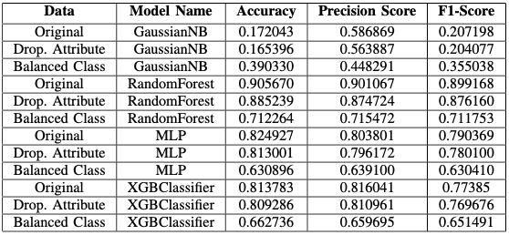

# Analysis of Zomato Data 
## Data Mining Project - 2019
---
In this project the Bangalore restaurant data analysis is done. Main motive of this project is to get a model to predict the rating of the restaurdent rating using the features of the restaurant like menu items, location, price range etc.
 
So, in this dataset is used of [Kaggle](https://www.kaggle.com/himanshupoddar/zomato-bangalore-restaurants). For the analysis of the data it's 3 versions are used:
1. Original Dataset.
2. By Dropping least useful attributes.
3. Class Balanced Dataset.
 

## Tasks

So, in this two tasks have been done first where reviewer's data have generated and another where reviewer's data haven't been taken.

## Feature Engineering

Following Methods have been used:
1. Voting Feature Selector using LinearRegression, RFE, Ridge, Lasso & RandomForestRegressor and dropping the attributes whose Mean Ranking is  <= 0.35.
2. Using Xgboost feature importance ranking.

## Results:

All Right Reserved to Repository Owner.
